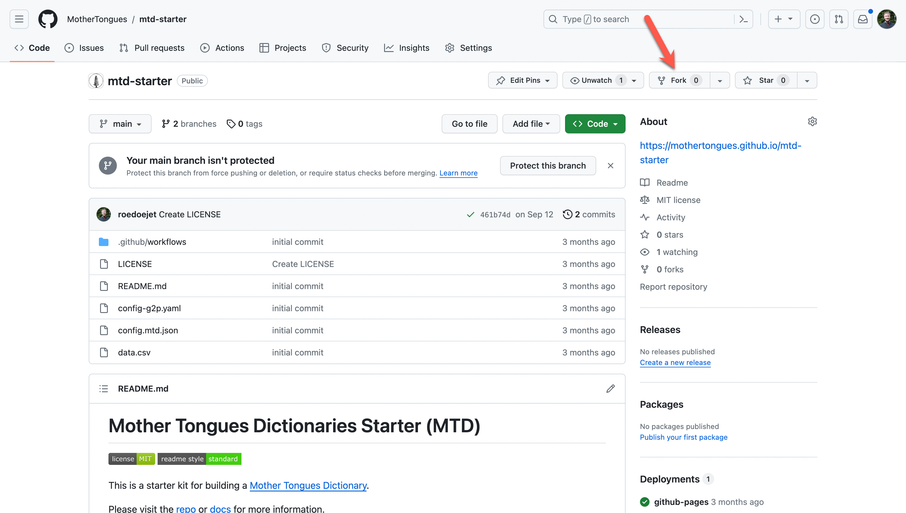
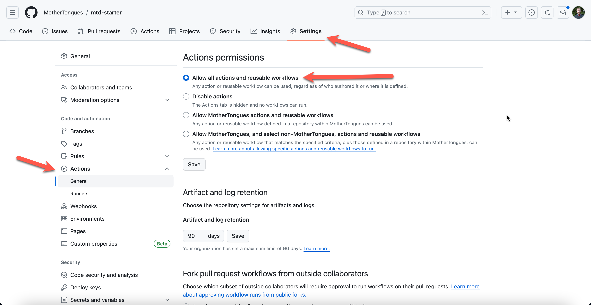
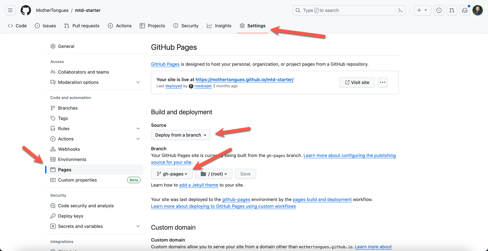
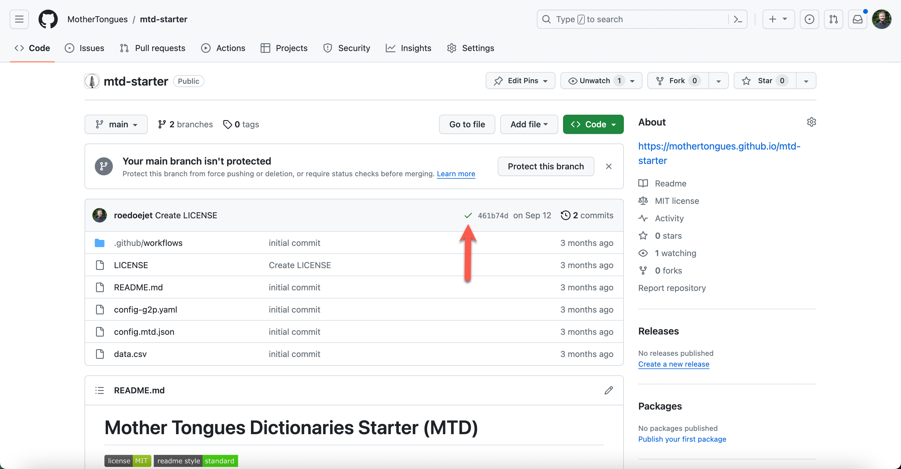

# No Code Installation

### What you need to know to understand this article
I’ve re-written this article to be a centered towards users who might not have a web development environment installed on their computer.

Regardless, in order to do this, you’ll have to your hands dirty in some code. If that already sounds intimidating, hopefully you continue to read on a bit - it might be scary at first but it gets easier! Remember there are a lot of resources online to help you and you can always reach out to me if you have questions.

!!! prerequistes

    To start, you need a [GitHub Account](https://github.com/) and a text editor for code (I like [Visual Studio Code](https://code.visualstudio.com/)).

### Step 1: Get the Code

To get the code, log in to your [GitHub Account](https://github.com/), then visit [the starter repository](https://github.com/MotherTongues/mtd-starter) and 'fork' the repository (fancy code-speak for making a copy). To do so, click on the "fork" button as shown below:

### Step 2: Turn on GitHub Actions

Turn on GitHub Actions which will do the automatic building of your site. To do so, go to "Settings", then "Actions" and ensure that it's enabled as shown below:

### Step 3 Activate GitHub Pages

You'll need to turn on GitHub Pages so that your site will be displayed publicly. By default it will be shown at https://<YourGitHubUserName>.github.io/mtd-starter  To activate GitHub Pages, go to "Settings", then "Pages" and turn it on as shown below:

### Step 4: Add your data

Once you are sure you have permission to use and publish the data you are using, you can drag and drop your `data.csv` file into your fork.

Remember: Getting dictionary data together can take a long time. You can always upload a small subset to play around with the dictionary in the meantime.

!!! Important

    Do you have permission? Uploading data.csv will result in the data being published to your public github page. You must have permission to make the data you are using public first. If you do not want public access to your dictionary, you must follow the [advanced developer guide](../developer/prerequisites.md).

For more details on preparing your dictionary data, see [Preparing Your Data](../guides/prepare.md)

### Step 5: See your dictionary!

When your dictionary is finished building, you will see a green checkmark as shown below. Then you can visit your dictionary at https://<YourGitHubUserName>.github.io/mtd-starter

